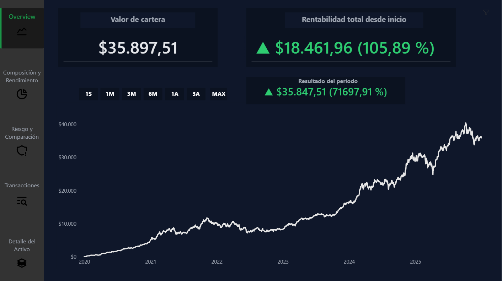
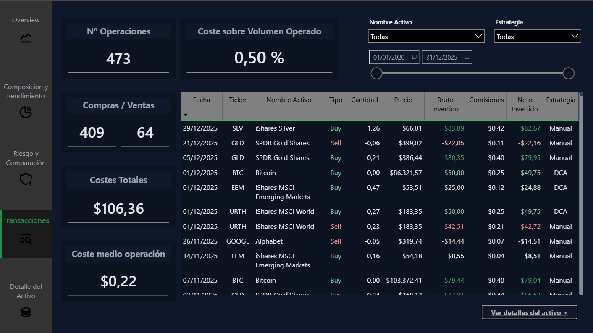

# powerbi-analisis-cartera-inversion
## Dashboard de Seguimiento de Cartera de Inversión (Power BI)
Enlace al Dashboard de Power BI: [Cartera Inversión](https://app.powerbi.com/view?r=eyJrIjoiNzBmMWUzNmItMzJhNi00MTEzLWJiN2UtN2MxYTc1MTMyMzZiIiwidCI6IjhmMGQ0NTJjLWI3YTQtNDk2NC1iODEwLThjMzk3Mzc0NDc3YiIsImMiOjh9&pageName=f55a4d30671540ec1591)
### 🎯 Contexto del proyecto

Este proyecto se desarrolló con el objetivo de construir un dashboard que permitiera analizar una cartera de inversión de forma estructurada, separando claramente:
1. la visión global de la cartera
2. La composición y el rendimiento
3. El análisis del riesgo y la comparación con benchmarks
4. La operativa de transacciones
5. El detalle por activo
El foco no está en mostrar visualizaciones aisladas, sino en responder preguntas concretas de negocio mediante métricas consistentes.

### ❓ Preguntas que responde el dashboard

· ¿Cómo ha evolucionado el valor de la cartera a lo largo del tiempo?  
· ¿Cuál es el resultado de un período seleccionado en términos absolutos y relativos?  
· ¿Cuál es la composición de la cartera según tipo y activo? Cuál es la rentabilidad de cada uno?  
· ¿Cómo varía el riesgo (volatilidad y drawdown) según el horizonte temporal?  
· ¿Cómo se comporta la cartera frente a un benchmark?  
· ¿Qué impacto tienen los activos y las transacciones individuales en el resultado total?  
· ¿Cuál ha sido la evolución de un activo concreto en la cartera?¿He comprado y vendido el activo en momentos óptimos?  

### 🧭 Estructura del informe

El informe está organizado en las siguientes páginas:  

#### Overview
Visión general de la evolución del valor de la cartera y del resultado del período seleccionado.

#### Composición y rendimiento
Distribución de la cartera por tipo de activo y activo. Rentabilidad por tipo de activo y activo.

#### Riesgo y Benchmark
Análisis de volatilidad, drawdown y comparación con un benchmark, respetando el contexto temporal seleccionado.

#### Transacciones
Detalle de la operativa de compras y ventas, incluyendo costes y métricas operativas.

#### Detalle del activo
Análisis individual de un activo, con evolución de la posición y su historial de transacciones.  

### 🖼️ Capturas del dashboard
Overview

Composición y Rendimiento

Riesgo y Comparación

Transacciones

Detalles del activo
  

### 📐 Métricas clave

El dashboard incluye, entre otras, las siguientes métricas:  
· Valor de mercado de la cartera  
· Resultado del período (absoluto y porcentual)  
· Volatilidad (diaria y anualizada)  
· Máximo drawdown  
· Ratio de Sharpe  
· PnL y rentabilidad por activo  

### 🗂️ Modelo de datos
El modelo de datos se basa en un enfoque tipo estrella, con:  
· Tabla de fechas  
· Tabla de activos  
· Tabla de transacciones  
· Histórico de precios  
· El modelo está diseñado para permitir análisis temporales dinámicos sin romper la coherencia de las métricas.  

### 🐍 Preparación de datos (Python)
#### La arquitectura es la siguiente:  
assets.csv  
   ↓  
build_prices_master.py   → Prices_Master.csv  
   ↓  
build_prices_filled.py   → Prices_Filled.csv  
   ↓  
build_transactions.py    → Transactions.csv  

La preparación de datos se realiza mediante tres scripts en Python, siguiendo un flujo secuencial y desacoplado.

#### 1. Descarga de precios (`build_prices_master.py`)
Descarga precios históricos desde Yahoo Finance a partir del fichero `assets.csv`, 
normalizando el formato y generando una tabla maestra de precios (`Prices_Master.csv`) sin relleno temporal.

#### 2. Normalización temporal (`build_prices_filled.py`)
A partir de la tabla maestra, se construye una serie diaria continua por activo mediante fill-forward del último precio válido,  
generando la tabla definitiva de precios (`Prices_Filled.csv`) utilizada en Power BI.

#### 3. Generación de transacciones (`build_transactions.py`)
Se genera una tabla de transacciones realista combinando:  
- Inversión periódica (DCA)  
- Operativa manual de compra y venta  

El proceso respeta límites mensuales de capital, controla posiciones por activo y normaliza importes, comisiones y signos, produciendo una tabla `Transactions.csv` lista para análisis.  
Este enfoque garantiza coherencia entre precios y transacciones, así como una separación clara entre datos raw y datos preparados para BI.  
Se incluye un script en Python para la construcción de la tabla de transacciones a partir de datos brutos exportados del broker.    

El script se encarga de:  
· Normalizar compras y ventas  
· Aplicar convenciones de signo para flujos de caja  
· Gestionar comisiones  
· Generar una tabla limpia lista para Power BI  

#### 🛠️ Herramientas utilizadas

· Power BI (modelado de datos, DAX, diseño del informe)  
· DAX (métricas de rentabilidad, riesgo y performance)  
· Python (preparación y limpieza de datos)  

### ⚠️ Limitaciones y mejoras futuras
· Posible incorporación futura de métricas de rentabilidad ponderadas por tiempo o dinero.  
· Automatización del flujo de actualización de datos.  

🔚 Nota final
Este proyecto forma parte de un portfolio personal orientado a posiciones junior de Data / BI Analyst, con especial interés en análisis financiero y reporting.
